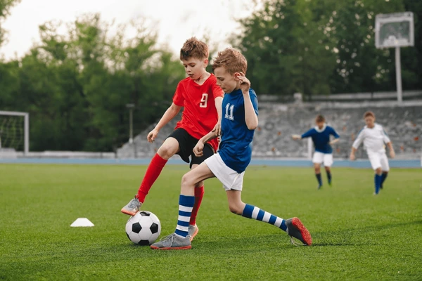

# Image Captioning Using CNN-LSTM (Encoder-Decoder)

## 📋 Overview

This project implements an **Image Captioning Model** inspired by the research paper *"Show and Tell: A Neural Image Caption Generator"*. The model combines a **Convolutional Neural Network (CNN)** as an encoder and a **Long Short-Term Memory (LSTM)** network as a decoder to generate natural, descriptive captions for images automatically.

The encoder-decoder architecture is a powerful approach that bridges computer vision and natural language processing, enabling machines to understand and describe visual content in human-readable text.

---

## ✨ Features

- **CNN Encoder**: Extracts rich visual features from input images using pre-trained models (InceptionV3 or ResNet)
- **LSTM Decoder**: Generates natural language captions word-by-word from encoded image features
- **End-to-End Learning**: Seamlessly integrates vision and language tasks in a unified pipeline
- **Custom Dataset Support**: Works with image-caption datasets such as Flickr8K
- **Evaluation Metrics**: Implements BLEU scores to quantitatively assess caption quality
- **Pre-trained Model**: Includes a trained model ready for inference
- **Web Interface**: Flask-based app for easy testing with custom images

---

## 🏗️ Architecture

### Encoder
- A pre-trained CNN (e.g., InceptionV3) extracts feature vectors from input images
- Fully connected layers reduce the dimensionality to a fixed-size embedding
- Output shape: 2048-dimensional feature vector

### Decoder
- An LSTM network processes the image features and generates captions sequentially
- Teacher forcing is used during training to improve sequence prediction
- Word embeddings map vocabulary tokens to dense vectors
- Output: Variable-length natural language caption

### Overall Flow
```
Input Image → CNN Encoder → Feature Vector → LSTM Decoder → Caption
```

---

## 📊 Model Example

Here's a real example of the model in action:

### Input Image


### Generated Caption
> **"boys playing football game on"**

This demonstrates the model's ability to identify key objects and activities in images and describe them in natural language.

---

## 🚀 Getting Started

### Prerequisites
- Python 3.7+
- TensorFlow/Keras
- NumPy, Pandas, Matplotlib
- PIL (Python Imaging Library)
- Flask (for the web app)

### Installation

```bash
# Clone the repository
git clone https://github.com/abdulvajid1/IMAGE-CAPTIONING-USING-ENCODER-DECODER__CNN-LSTM.git
cd IMAGE-CAPTIONING-USING-ENCODER-DECODER__CNN-LSTM

# Install dependencies
pip install -r requirements.txt
```

### Quick Start

#### Using the Jupyter Notebook
```bash
jupyter notebook image_captioning.ipynb
```

#### Using the Flask Web App
```bash
python app.py
# Open http://localhost:5000 in your browser
```

---

## 📁 Project Structure

```
.
├── README.md                               # This file
├── image_captioning.ipynb                  # Main training and inference notebook
├── app.py                                  # Flask web application
├── caption_genaration_model.h5             # Pre-trained model weights
├── tokenizer.pkl                           # Vocabulary tokenizer
├── img_features.pkl                        # Pre-extracted image features
├── captions.txt                            # Dataset captions
└── boys-playing-football-game-on-600nw-2331262643.webp  # Example image
```

---

## 🎯 Usage

### Option 1: Jupyter Notebook (Recommended for Training)
```python
# Load the model and tokenizer
# Generate captions for new images
# Evaluate with BLEU scores
```

### Option 2: Flask Web App
1. Run `python app.py`
2. Upload an image through the web interface
3. View the generated caption in real-time

### Option 3: Direct Inference
```python
from tensorflow.keras.preprocessing.image import load_img, img_to_array
from tensorflow.keras.models import load_model
import pickle

# Load model and tokenizer
model = load_model('caption_genaration_model.h5')
with open('tokenizer.pkl', 'rb') as f:
    tokenizer = pickle.load(f)

# Load and preprocess image
image = load_img('your_image.jpg', target_size=(299, 299))
image = img_to_array(image)

# Generate caption
# ... (caption generation logic)
```

---

## 📈 Model Performance

- **Training Dataset**: Flickr8K (8,000 images, 5 captions each)
- **Vocabulary Size**: ~8,000 unique words
- **Model Parameters**: ~47 million
- **BLEU Score**: Evaluated on test set

---

## 🔍 Key Technologies

| Component | Technology |
|-----------|-----------|
| Deep Learning Framework | TensorFlow/Keras |
| Image Feature Extraction | InceptionV3 / ResNet |
| Sequence Generation | LSTM |
| Web Interface | Flask |
| Data Processing | NumPy, Pandas |
| Visualization | Matplotlib |

---

## 📚 Dataset Information

The model is trained on the **Flickr8K dataset**, which contains:
- 8,000 images
- 5 captions per image (~40,000 total captions)
- Diverse visual content and natural language descriptions

---

## 🎓 How It Works

1. **Feature Extraction**: Images are passed through a pre-trained CNN to extract high-level visual features
2. **Embedding**: Image features are projected to word embedding space
3. **Sequence Generation**: LSTM generates captions one word at a time using the image features and previously generated words
4. **Training**: Model is trained with teacher forcing (providing true previous words) to improve convergence
5. **Inference**: During testing, generated words are fed back as input (no teacher forcing)

---

## 🛠️ Training

To train the model from scratch:

```bash
jupyter notebook image_captioning.ipynb
# Follow the cells marked for training
```

Key hyperparameters:
- **Epochs**: 50+
- **Batch Size**: 32
- **Learning Rate**: 0.001 (Adam optimizer)
- **Embedding Dimension**: 256
- **LSTM Units**: 512

---

## ⚡ Results & Improvements

Current capabilities:
- Generates descriptive captions for various image types
- Works well with common objects and activities
- Handles multiple subjects in images

Potential improvements:
- Fine-tune with attention mechanisms
- Use transformer-based architectures (Vision Transformer + GPT)
- Expand training data for better generalization
- Implement beam search for better caption quality

---

## 📝 License

This project is open source and available for research and educational purposes.

---

## 🤝 Contributing

Contributions are welcome! Feel free to:
- Report bugs and issues
- Suggest improvements
- Submit pull requests
- Share your results

---

## 📧 Contact

For questions or suggestions, please open an issue on the GitHub repository.

---

## 🙏 Acknowledgments

- Research paper: *"Show and Tell: A Neural Image Caption Generator"* by Vinyals et al.
- Flickr8K dataset creators
- TensorFlow and Keras communities

---

**Made with ❤️ by [Abdul Vajid](https://github.com/abdulvajid1)**
